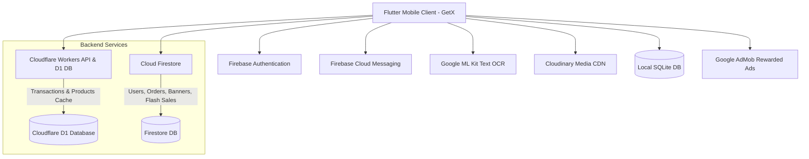
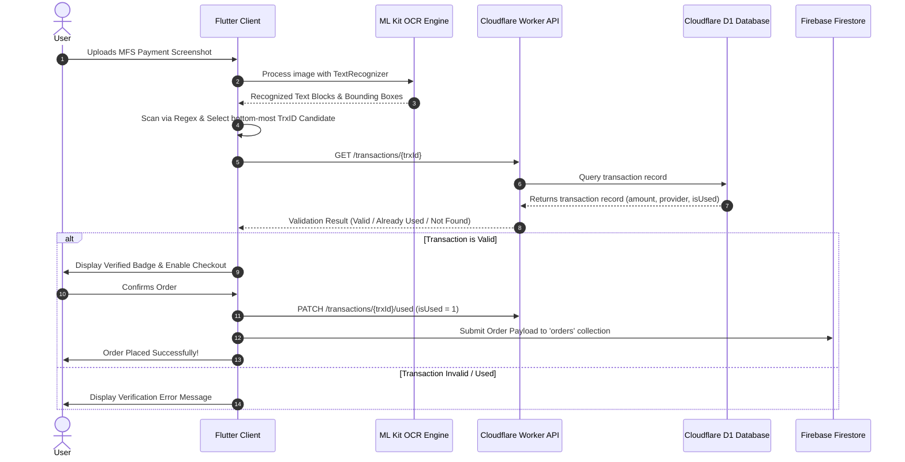

# 🏆 DADU — Sports E-Commerce Mobile Application

<p align="center">
  
</p>

<p align="center">
  <strong>A high-performance, feature-packed Flutter e-commerce application tailored for sports gear, apparel, and footwear with intelligent MFS payment verification and gamified rewards.</strong>
</p>

<p align="center">
  
  
  
  
  
  
  
</p>

---

## 📖 Table of Contents

- [Overview](#-overview)
- [Key Features](#-key-features)
- [Architecture & Tech Stack](#-architecture--tech-stack)
- [Project Directory Structure](#-project-directory-structure)
- [Intelligent Payment Verification & OCR Pipeline](#-intelligent-payment-verification--ocr-pipeline)
- [Environment Configuration](#-environment-configuration)
- [Installation & Getting Started](#-installation--getting-started)
- [Services & Backend Integration](#-services--backend-integration)
- [State Management & Data Flow](#-state-management--data-flow)
- [Contributing](#-contributing)
- [License](#-license)

---

## 🌟 Overview

**DADU** is an enterprise-grade sports e-commerce mobile application built for athletes, sports enthusiasts, and teams in Bangladesh. It provides a seamless shopping experience for football boots, jerseys, goalkeeper gloves, sportswear, safeguards, and sports accessories.

The app combines **Firebase**, **Cloudflare Workers & D1 Database**, **Cloudinary Media Services**, and on-device **Google ML Kit OCR** to deliver fast product catalog indexing, real-time order tracking, automated MFS payment verification (bKash/Nagad/Rocket), gamified loyalty rewards, and customer support messaging.

---

## ✨ Key Features

### 🛍️ 1. Dynamic Shopping & Product Catalog
- **Paginated Feed & Infinite Scrolling:** Fast, cached product pagination powered by Cloudflare Workers and Firebase Firestore.
- **Categorized & Brand Browsing:** Filter by categories (*Boots, Gloves, Jerseys, Pants, Bags, Safeguards, Socks*) or top sports brands (*Adidas, Nike, Puma, Mizuno, DADU Originals*).
- **Combo Packs & Bundles:** Dedicated section for discounted combo offers and bundle packages.
- **Flash Sales with Live Countdown:** Real-time countdown timer synchronized with server timestamps, featuring special discounted prices.
- **New Arrivals Showcase:** Highlight reel of newly stocked sports gear.
- **Interactive Product Details:** High-resolution multi-angle image gallery with full-screen zoom, size picker, delivery fee breakdown, video review integrations, and stock validation.
- **Smart Debounced Search:** Fast real-time product search with keyword indexing and debounce mechanisms.

### 💳 2. Smart Checkout & AI-Powered Payment Verification
- **Automated Receipt Scanning (Google ML Kit OCR):** Users can upload payment screenshots (bKash, Nagad, Rocket); on-device OCR extracts the Transaction ID (TrxID) using spatial bounding-box algorithms and regex heuristics.
- **Cloudflare D1 Anti-Fraud Verification:** Live API verification verifies whether the TrxID exists in the merchant transaction ledger, validates received amounts, and ensures single-use validation (`isUsed` status) to eliminate fraud.
- **Bangladesh Geolocation Engine:** Built-in district and upazila/thana directory for Bangladesh (64 districts) with accurate shipping charge calculation.
- **Coin & Discount Redemption:** Apply Gold and Silver loyalty coins to waive delivery charges or receive instant cart discounts.

### 🪙 3. Loyalty & Gamification System
- **Dual Coin Economy:**
  - **Gold Coins:** Earned through purchases; redeemable for free delivery perks.
  - **Silver Coins:** Earned via AdMob rewarded video ads; redeemable for direct order discounts.
- **AdMob Rewarded Video Ads:** Watch ads with daily limit tracking (30 ads/day), cooldown timers, anti-abuse verification, and monthly analytics aggregation.
- **Lucky Gift Box Draw:** Interactive lucky draw module where registered users can participate to win free sports merchandise, complete with a live winner board.

### 💬 4. In-App Customer Support Chat
- **Real-Time Helpdesk:** Direct communication channel between customers and store admins.
- **Image Attachments:** Fast photo compression (`flutter_image_compress`) and secure upload to Cloudinary.
- **Unread Counters & Push Triggers:** Visual badges and instant push notifications for admin responses.

### 🔔 5. Notifications & Deep Linking
- **Push Notifications (FCM):** Targeted and broadcast push notifications (`allUsers` topic) for new offers, order updates, and messages.
- **Offline SQLite Notification Inbox:** Local storage (`sqflite`) storing notification history with read/unread statuses.
- **Top Pull-Down Notification Sheet:** Interactive gesture-driven notification drawer with filtering between general promos and admin chats.
- **Deep Linking (`app_links`):** Seamless navigation directly to specific products, brands, categories, tabs, or the coin-reward center via deep link URLs.

### 🔄 6. In-App Updates & Authentication
- **Google Play In-App Updates:** Automatic update prompts (Immediate & Flexible updates) via `in_app_update`.
- **Hybrid Authentication:** Email & password authentication with password reset, alongside anonymous guest login and account migration.

---

## 🏗️ Architecture & Tech Stack



| Layer | Technology |
|---|---|
| **Framework** | [Flutter](https://flutter.dev/) (Dart SDK `^3.7.0`) |
| **State Management** | [GetX](https://pub.dev/packages/get) (`Rx`, `GetxController`, `Obx`) |
| **Authentication** | [Firebase Auth](https://pub.dev/packages/firebase_auth) (Email/Password, Anonymous) |
| **Cloud Database** | [Cloud Firestore](https://pub.dev/packages/cloud_firestore) & [Cloudflare D1](https://developers.cloudflare.com/d1/) |
| **Backend & APIs** | [Cloudflare Workers](https://workers.cloudflare.com/) (Serverless REST API) |
| **Local Storage** | [SQFlite](https://pub.dev/packages/sqflite) (Notifications DB) & [Path Provider](https://pub.dev/packages/path_provider) |
| **Machine Learning / OCR** | [Google ML Kit Text Recognition](https://pub.dev/packages/google_mlkit_text_recognition) |
| **Media & Storage** | [Cloudinary](https://cloudinary.com/) + [Flutter Image Compress](https://pub.dev/packages/flutter_image_compress) |
| **Push Notifications** | [Firebase Messaging (FCM)](https://pub.dev/packages/firebase_messaging) |
| **Deep Links** | [App Links](https://pub.dev/packages/app_links) |
| **Monetization** | [Google Mobile Ads (AdMob)](https://pub.dev/packages/google_mobile_ads) |
| **In-App Updates** | [In App Update](https://pub.dev/packages/in_app_update) |

---

## 📂 Project Directory Structure

```text
DADU/
├── android/                        # Native Android configuration & manifests
├── assets/                         # Static assets & icons
│   ├── icon/                       # Brand logos, category icons, UI badges
│   ├── info_banner/                # Animated promotional banners & GIFs
│   └── logo/                       # Brand logos
├── ios/                            # Native iOS configuration
├── lib/
│   ├── main.dart                   # Application entrypoint & initializations
│   ├── component/                  # Reusable UI components
│   │   ├── gitf_box_banner.dart    # Free gift promotional banner
│   │   └── notification_sheet.dart # Top notification drop-down drawer
│   ├── controller/                 # GetX business logic controllers
│   │   ├── chat_controller.dart    # Chat messaging and image upload logic
│   │   └── home_controller.dart    # Home feed, banners, search, cart counts
│   ├── data/                       # Static datasets
│   │   └── district_upozila.dart   # Bangladesh 64 Districts & Upazilas
│   ├── exceptions/                 # Custom application exception handlers
│   ├── model/                      # Data models
│   │   └── cart_model.dart         # CartItem data structure
│   ├── screen/                     # Application screens & UI views
│   │   ├── authentication/         # Auth screens (Sign In, Sign Up 1/2, Forgot Password)
│   │   ├── product/                # Product browsing, categories, details, flash sale, search
│   │   └── user/                   # Cart, Checkout, Order List, Profile, Chat, Reward Ads
│   ├── services/                   # Backend, API, DB, and device services
│   │   ├── api.dart                # Cloudinary image compression & upload service
│   │   ├── app_version_service.dart# Play Store in-app update checker
│   │   ├── auth.dart               # Firebase Authentication wrapper
│   │   ├── d1.dart                 # Cloudflare Worker API client (Products, Messages)
│   │   ├── deep_link_service.dart  # URI link stream & push notification routing
│   │   ├── firebase.dart           # Cloud Firestore operations & queries
│   │   ├── local_notification_db.dart # Local SQLite database for notifications
│   │   ├── notification_service.dart  # Firebase Cloud Messaging handler
│   │   ├── transaction_id_extractor.dart # Google ML Kit OCR TrxID extraction
│   │   └── transaction_verification_service.dart # D1 Transaction verification
│   └── theme/
│       └── app_colors.dart         # Global color palette and UI tokens
├── .env                            # Environment variables (API URLs, Cloudinary keys)
├── pubspec.yaml                    # Flutter project dependencies & asset configuration
└── README.md                       # Project documentation
```

---

## 🔍 Intelligent Payment Verification & OCR Pipeline



---

## ⚙️ Environment Configuration

Create a `.env` file in the root directory of the project:

```env
# Cloudinary Media Configuration
CLOUD_NAME=your_cloudinary_cloud_name
UPLOAD_PRESET=your_upload_preset
API_KEY=your_cloudinary_api_key
API_SECRET=your_cloudinary_api_secret

# Backend API Endpoint (Cloudflare Worker)
API_BASE_URL=https://your-api.workers.dev
```

> **Note:** Ensure `.env` is declared in `pubspec.yaml` under the `assets:` section so it is bundled with the build.

---

## 🚀 Installation & Getting Started

### Prerequisites
- [Flutter SDK](https://docs.flutter.dev/get-started/install) (`>= 3.7.0`)
- [Dart SDK](https://dart.dev/get-dart) (`>= 3.7.0`)
- Android Studio / VS Code with Flutter extensions
- Android device or emulator with Google Play Services (API Level 21+)
- A configured Firebase project with `google-services.json` placed in `android/app/`

### Step-by-Step Setup

1. **Clone the Repository:**
   ```bash
   git clone https://github.com/sayedulmorsalin/DADU.git
   cd DADU
   ```

2. **Install Dependencies:**
   ```bash
   flutter pub get
   ```

3. **Configure Firebase:**
   - Place your `google-services.json` inside `android/app/`.
   - Place your `GoogleService-Info.plist` inside `ios/Runner/` (if targeting iOS).

4. **Set Up Environment Variables:**
   - Create `.env` in the root folder with your Cloudinary and API parameters as shown in [Environment Configuration](#-environment-configuration).

5. **Generate Launcher Icons (Optional):**
   ```bash
   dart run flutter_launcher_icons
   ```

6. **Run the Application:**
   ```bash
   # Run in debug mode
   flutter run

   # Or build an Android APK
   flutter build apk --release
   ```

---

## 📡 Services & Backend Integration

### 1. Cloudflare Workers REST API
The app communicates with Cloudflare Workers for ultra-fast catalog and transaction queries:

- `GET /products?limit=20&page=1&catagory=&brand=&q=&ids=` — Paginated & filtered product search.
- `GET /products/:id` — Fetch single product details.
- `GET /transactions/:trxId` — Verify Mobile Financial Service (MFS) transaction details.
- `PATCH /transactions/:trxId/used` — Mark transaction ID as consumed upon successful checkout.
- `GET /messages/:userId?limit=20&page=1` — Fetch paginated chat history.
- `POST /messages` — Send support message with optional image URL.

### 2. Firebase Cloud Firestore Schema Overview
- **`users/`** — User profiles, coin balances (`free_delivery_info`, `silver_coin`), saved delivery addresses, and cart data.
- **`products/`** — Product records (name, brand, price, details, images, stock, video links).
- **`orders/`** — Customer submitted orders, shipping addresses, ordered items, and payment transaction metadata.
- **`banners/`** — Promotional slider banners.
- **`flash_sell_products/` & `flash_sell_timer/`** — Live flash sale pricing and expiry timers.
- **`free_gift/`** — Free gift box winners and campaign metadata.
- **`ad_analytics/`** — Reward ad pricing rates and monthly impression aggregation.

---

## 🧭 Deep Link Reference

The app supports custom deep links handled by `DeepLinkService`:

| Deep Link URI | Action |
|---|---|
| `dadu://app/product?id=<PRODUCT_ID>` | Opens product details screen |
| `dadu://app/brand?name=<BRAND_NAME>` | Opens brand catalog page |
| `dadu://app/category?name=<CATEGORY_NAME>` | Opens category catalog page |
| `dadu://app/earn-coins` | Opens rewarded ads coin center |
| `dadu://app/cart` | Switches to Cart tab |
| `dadu://app/search` | Switches to Search tab |
| `dadu://app/message` | Switches to Support Chat tab |
| `dadu://app/profile` | Switches to Profile tab |

---

## 🤝 Contributing

Contributions, issues, and feature requests are welcome!

1. Fork the Project
2. Create your Feature Branch (`git checkout -b feature/AmazingFeature`)
3. Commit your Changes (`git commit -m 'Add some AmazingFeature'`)
4. Push to the Branch (`git push origin feature/AmazingFeature`)
5. Open a Pull Request

---

## 📄 License

Distributed under the [MIT License](LICENSE).

---

<p align="center">
  Developed with ❤️ for <strong>DADU Khelaghor</strong>
</p>
